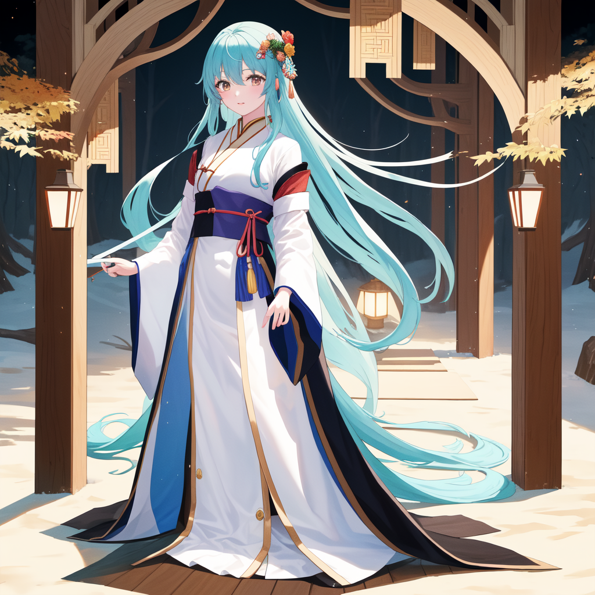
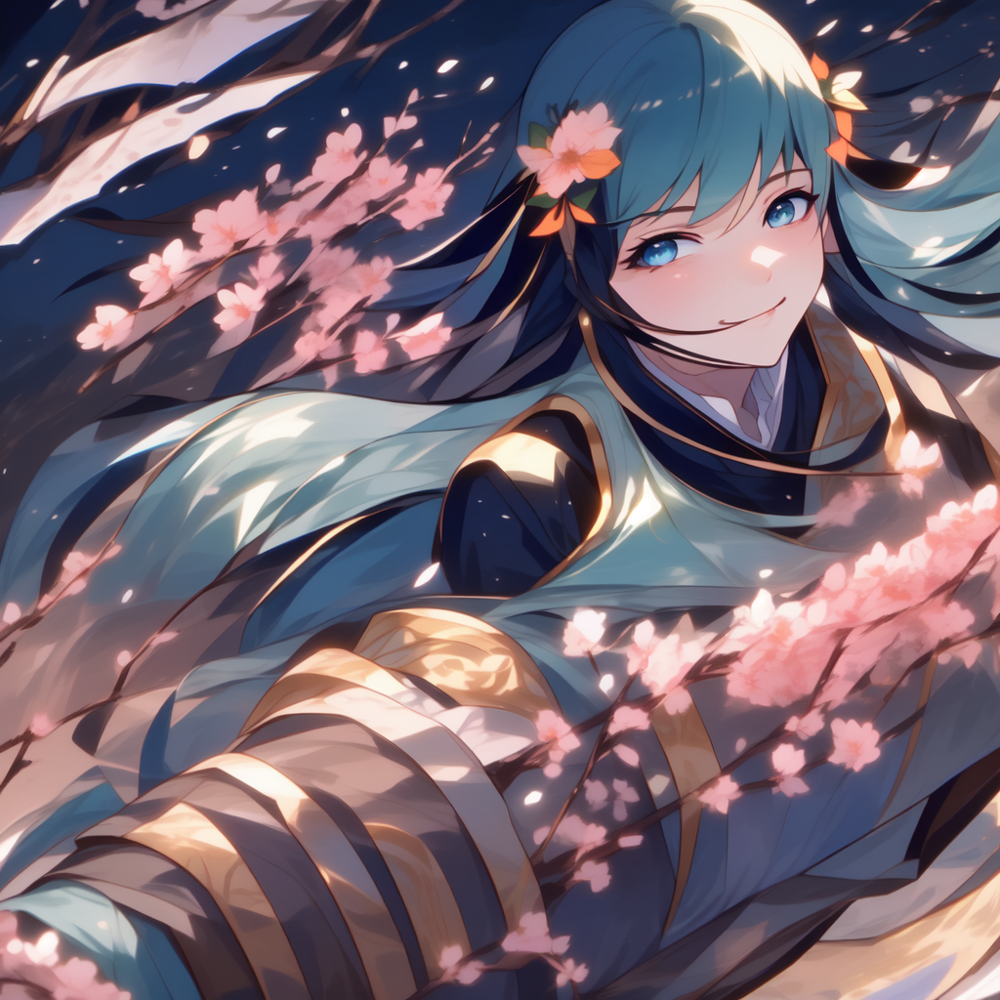
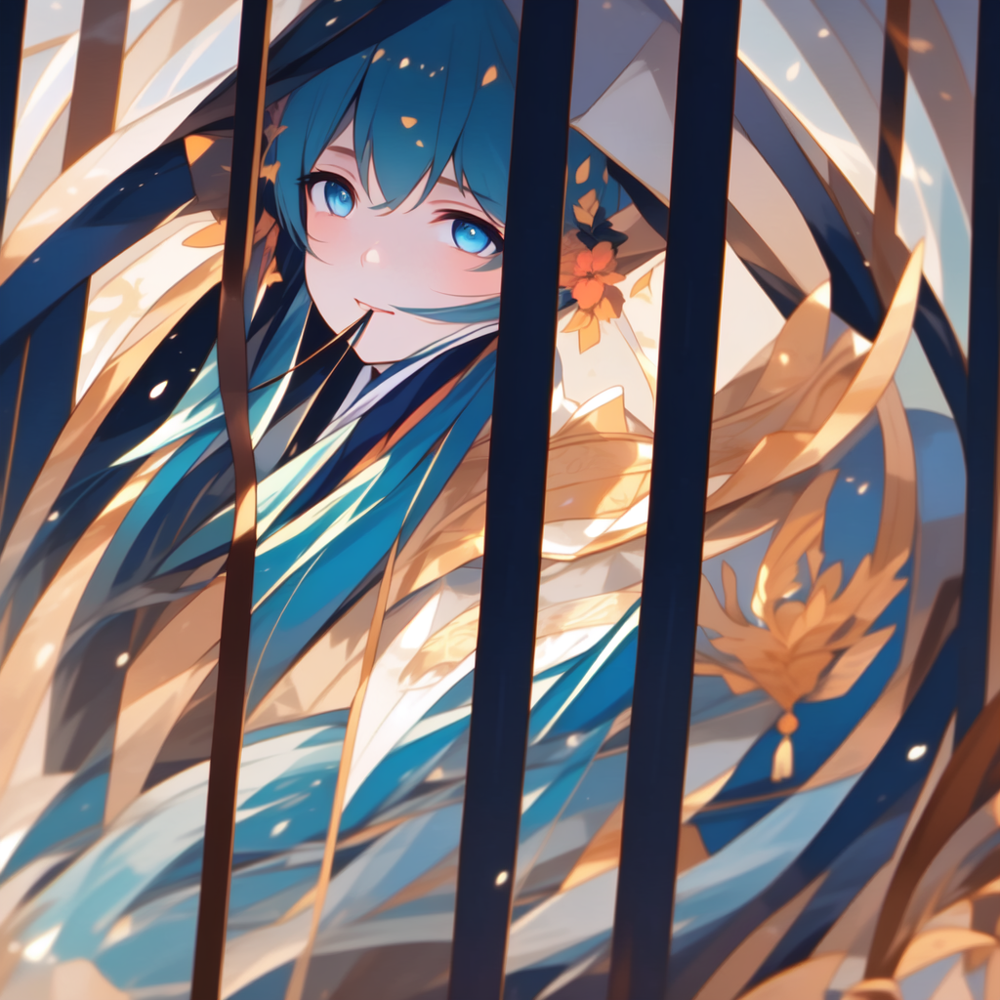

# 你自己的AI生图 (Your Own AI Image Gen)

🎨 本地运行、无需联网的 AI 图像生成工具。支持单图生成和漫画分镜批量创作，角色一致性好。

---

## 🚨 重要法律声明与使用条款

> **⚠️ 警告：本项目使用无审查（Uncensored）AI模型，具有生成任何类型图像的技术能力。使用者必须严格遵守法律法规，开发者对任何滥用行为不承担任何责任。**

### 一、项目定位

本项目是**开源学术研究工具**，旨在：
- 探索本地 AI 图像生成的技术边界
- 为创作者提供自由表达的创作环境
- 研究角色一致性、风格迁移等 AI 绘画技术

**本项目不是内容生产平台，不提供、不托管、不传播任何第三方内容。**

### 二、明确禁止的行为

使用本工具时，**严格禁止**以下行为：

- ❌ **生成、传播或分发任何违法内容**（包括但不限于色情、暴力、仇恨言论、儿童相关内容）
- ❌ **侵犯他人知识产权**（未经授权使用他人角色、商标、版权素材）
- ❌ **用于任何商业色情产业或相关服务**
- ❌ **冒充、诽谤或损害任何真实人物的肖像权和名誉权**
- ❌ **生成可能误导公众的深度伪造（Deepfake）内容用于恶意目的**
- ❌ **将生成内容用于诈骗、勒索、骚扰等犯罪活动**

### 三、使用者责任

下载、安装或使用本软件，即表示您同意并承诺：

1. **您年满 18 周岁或已达到所在司法管辖区的法定成年年龄**
2. **您对自己使用本工具生成的所有内容承担全部法律责任**
3. **您仅将本工具用于合法的个人学习、艺术创作或学术研究**
4. **您不会将本工具或生成的内容用于任何商业违法活动**
5. **您理解并同意开发者无法且不会对您的使用行为进行审查或监控**

### 四、免责声明

**开发者明确声明：**

- 本工具按"原样"（AS IS）提供，**不作任何明示或暗示的担保**
- 开发者**不对因使用或无法使用本工具而引起的任何损失、索赔或损害负责**
- 开发者**不对用户生成的任何内容承担审查、监控或法律责任**
- 开发者**保留随时修改、终止或限制本工具访问的权利，无需事先通知**
- 如用户违反上述条款，开发者**保留配合执法机关调查的权利**

### 五、开源协议

本项目代码以 [MIT License](LICENSE) 开源。MIT License 仅适用于**源代码本身**，不延伸至用户生成的内容，也不构成对任何违法行为的许可或授权。

**代码开源 ≠ 使用无限制。请严格遵守当地法律。**

---

## 功能亮点

| 功能 | 说明 |
|---|---|
| 🎨 **单图生成** | 中文提示词 → AI 自动翻译优化 → ComfyUI 出图 |
| 📖 **漫画工作室** | 角色设定 + 分镜脚本 → 批量生成同角色不同场景的图片 |
| 🎭 **三模式** | Action Free / Face Lock / **IPAdapter**（推荐） |
| 🧠 **IPAdapter** | txt2img + 人脸特征注入，动作自由且角色一致 |
| 🌈 **风格预设** | Soft Moe / Dark Dramatic / Watercolor 一键切换 |
| 🎬 **电影级分镜** | 自动构图变化 + 氛围渲染 + 表情动作加权 |
| 🔧 **模型切换** | 支持 dreamshaper / pony / meinamix 等多种模型 |
| 🖥️ **纯本地** | 所有模型、推理、图片全部在本地完成，无需联网 |

---

## 运行环境

- **操作系统**：Windows 10/11
- **Python**：3.10+
- **GPU**：NVIDIA 显卡，至少 6GB 显存（推荐 8GB+）
- **依赖**：Ollama（提示词优化）+ ComfyUI（图像生成）+ **IPAdapter Plus**（角色一致性）

---

## 界面展示

### 🎨 单图生成
单图生成界面，中文提示词自动翻译优化：


### 📖 漫画工作室（IPAdapter 模式推荐）
角色设定 + 分镜脚本 + 电影级提示词优化，一键批量生成同角色剧情分镜：


### 🧠 IPAdapter 角色一致性
基于参考图注入角色面部特征，跨场景保持同一张脸，动作完全自由：



### 📚 漫画分镜生成结果
同角色不同动作/场景/表情的批量生成效果（IPAdapter 模式）：





---

## 作品展示

> **以下展示内容均为技术演示，仅用于展示工具功能，不代表任何立场或倾向。**

### 🎭 角色设定


### 📖 漫画分镜


---

## 快速开始

### 1. 安装依赖

- 安装 [Ollama](https://ollama.com) 并拉取 `wizardlm-uncensored`：
  ```bash
  ollama pull wizardlm-uncensored
  ```
- 安装 [ComfyUI](https://github.com/comfyanonymous/ComfyUI) 到 `~/ComfyUI/` 目录
- **安装 IPAdapter Plus 插件**（用于角色一致性）：
  ```bash
  cd ~/ComfyUI/custom_nodes
  git clone https://github.com/cubiq/ComfyUI_IPAdapter_plus.git
  ```

### 2. 下载模型

将 `.safetensors` 模型文件放到 `ComfyUI/models/checkpoints/`：

| 模型 | 推荐用途 | 下载 |
|---|---|---|
| `dreamshaper_8.safetensors` | 通用写实 | [Civitai](https://civitai.com/models/4384/dreamshaper) |
| `meinamix_v12Final.safetensors` | 二次元萌系（推荐） | [Civitai](https://civitai.com/models/7240/meinamix) |
| `ponyDiffusionV6XL_v6.safetensors` | 二次元插画 | [Civitai](https://civitai.com/models/257749/pony-diffusion-xl-v6) |

**IPAdapter 模型**（放到 `ComfyUI/models/ipadapter/`）：

| 文件 | 说明 | 下载 |
|---|---|---|
| `ip-adapter-plus-face_sd15.safetensors` | 脸部特征注入（推荐） | [HuggingFace](https://huggingface.co/h94/IP-Adapter/resolve/main/models/ip-adapter-plus-face_sd15.safetensors) |
| `ip-adapter-plus_sd15.safetensors` | 通用 Plus 版本 | [HuggingFace](https://huggingface.co/h94/IP-Adapter/resolve/main/models/ip-adapter-plus_sd15.safetensors) |

**CLIP Vision 模型**（放到 `ComfyUI/models/clip_vision/`）：

| 文件 | 下载 |
|---|---|
| `CLIP-ViT-H-14-laion2B-s32B-b79K.safetensors` | [HuggingFace](https://huggingface.co/h94/IP-Adapter/resolve/main/models/image_encoder/model.safetensors) |

> **注意**：模型由第三方提供，下载和使用请遵守 Civitai 平台规则及模型作者的使用条款。

### 3. 运行

双击 `start.bat` 启动程序（会自动检测并启动 Ollama 和 ComfyUI）。

---

## 使用指南

### 🎨 单图生成

1. 在「单图生成」Tab 输入中文描述
2. 点击 **GENERATE**
3. 左侧显示优化后的英文提示词，右侧显示生成的图片

### 📖 漫画工作室

1. **角色设定**：填写角色外貌（脸型、发型、眼睛颜色等固定特征）
2. **生成角色设定图**：点击「🎨 Generate Character Sheet」生成参考图
3. **分镜脚本**：每行写一个场景（动作/表情/服装/背景）
4. **选择模式**：
   - **🧠 IPAdapter（强烈推荐）**：txt2img + 人脸注入，动作自由且脸一致
   - **🔒 Face Lock**：img2img + 参考图，脸最像但动作受限
   - **🎭 Action Free**：txt2img，每帧不同角色（不推荐用于故事漫画）
5. **参数调整**：
   - **Style Preset**：Soft Moe 适合 pastel 萌系风格
   - **Consistency**（Face Lock）：denoise 越低一致性越高
   - **Seed**：Fixed 推荐，Series 增加画面变化
6. 点击 **🚀 GENERATE COMIC** 批量生成

> **剧情提示词技巧**：描述越具体越好！例如不要只写"下雨"，写"惊讶地看着窗外下雨，穿着毛衣"——程序会自动优化为电影级提示词。

---

## 项目结构

```
your-own-ai-image-gen/
├── ai_image_studio.py        # 主程序（双 Tab GUI）
├── workflows/
│   ├── txt2img_api.json       # 单图生成 workflow
│   ├── img2img_api.json       # 漫画一致性 workflow
│   └── ipadapter_api.json     # IPAdapter 角色一致性 workflow
├── screenshots/               # 界面截图与作品展示
├── start.bat                  # Windows 启动脚本
├── README.md                  # 本文件
└── .gitignore
```

---

## 技术原理

**角色一致性（IPAdapter 模式 - 推荐）**：
- 参考图 → CLIP Vision 提取视觉特征 → IPAdapter 注入 UNet
- txt2img 正常生成（denoise=1.0），动作完全自由
- 模型"记得"角色长什么样，跨场景保持一致

**角色一致性（Face Lock 模式）**：
- img2img + 参考图打底（VAE Encode）+ 固定 Seed
- 脸部最像，但 denoise 越低动作越受限

**角色一致性（Action Free 模式）**：
- txt2img + 固定 Seed + 每帧注入完整角色描述
- 无需参考图，但一致性最差，适合单幅创作

**电影级提示词优化**：
- Ollama 专用漫画优化器：提取表情/动作/氛围三层结构
- 自动氛围渲染：天气/情绪/场景关键词 → 环境光影描述
- 自动构图变化：每帧不同电影镜头（特写/过肩/低角度/荷兰角等）
- 颜色保护：角色外貌颜色加权，防止场景颜色污染

---

## ⚠️ 再次提醒

**请在使用前再次确认您已阅读并同意上方的"重要法律声明与使用条款"。**

- 本工具仅用于**个人学习、艺术创作和学术研究**
- **严禁**用于生成、传播违法内容
- **严禁**侵犯他人知识产权和肖像权
- **使用者对自身行为承担全部法律责任**
- 开发者不对任何使用后果负责

**技术无罪，但使用有界。请做一个负责任的创作者。**

---

## 开源协议

本项目代码以 [MIT License](LICENSE) 开源。

> **MIT License 仅授予源代码的使用权限，不构成对任何违法行为的许可。所有使用者必须遵守当地法律法规。开发者保留追究违法使用者责任的权利。**

---

*本项目由 Eric-huang799 维护。如有技术问题，欢迎提交 Issue 讨论。*
