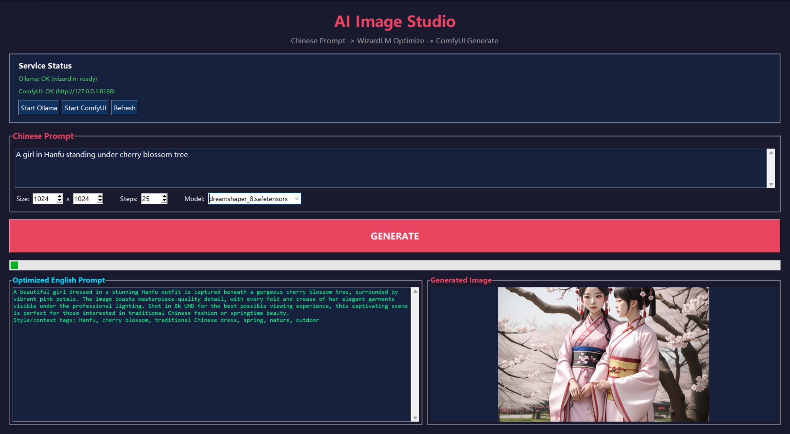
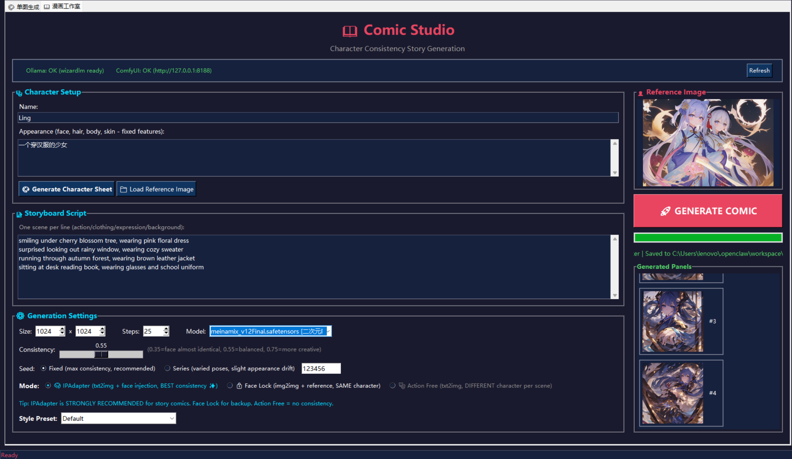
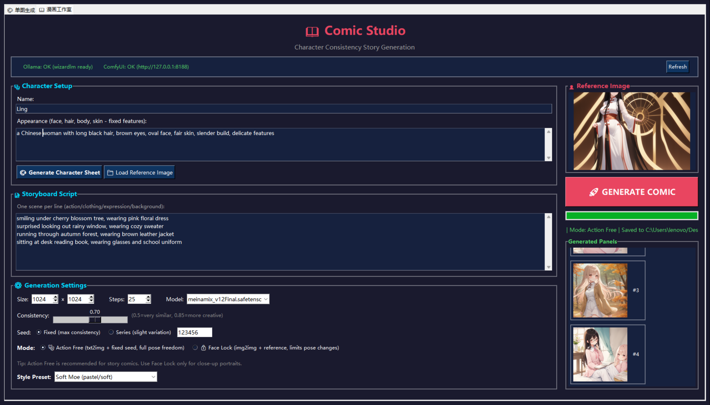
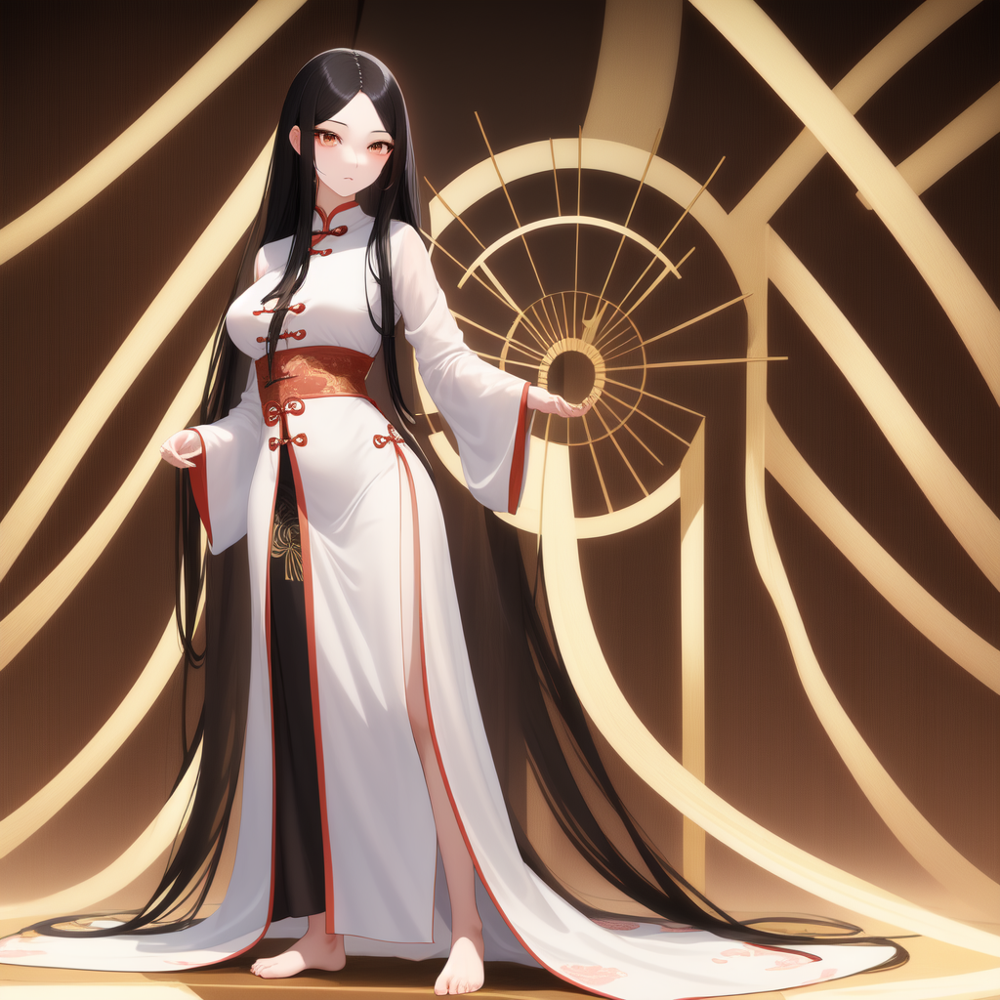
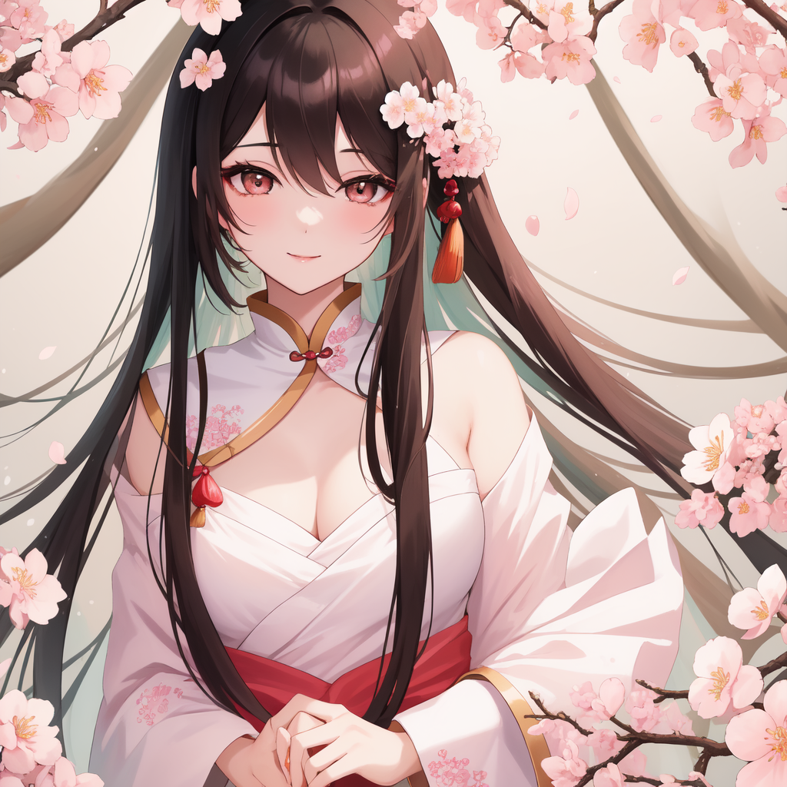
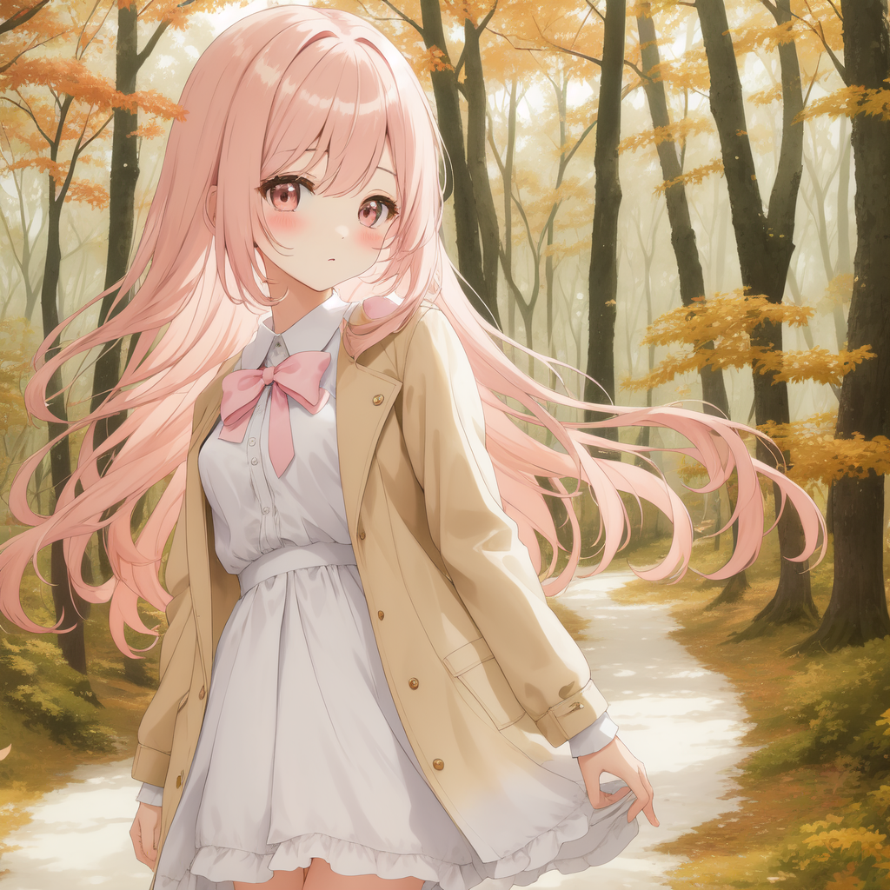

# 你自己的AI生图 (Your Own AI Image Gen)

🎨 本地运行、无需联网的 AI 图像生成工具。支持单图生成和漫画分镜批量创作，角色一致性好。

> ⚠️ **免责声明**：本项目使用的所有模型均为**无审查（Uncensored）**版本，旨在最大化创作自由度。使用者须对自己生成的全部内容承担法律责任，请确保遵守所在国家/地区的法律法规，仅用于合法、合规的创作目的。

---

## 功能亮点

| 功能 | 说明 |
|---|---|
| 🎨 **单图生成** | 中文提示词 → AI 自动翻译优化 → ComfyUI 出图 |
| 📖 **漫画工作室** | 角色设定 + 分镜脚本 → 批量生成同角色不同场景的图片 |
| 🎭 **双模式** | Action Free（动作自由）/ Face Lock（高一致性） |
| 🌈 **风格预设** | Soft Moe / Dark Dramatic / Watercolor 一键切换 |
| 🔧 **模型切换** | 支持 dreamshaper / pony / meinamix 等多种模型 |
| 🖥️ **纯本地** | 所有模型、推理、图片全部在本地完成，无需联网 |

---

## 运行环境

- **操作系统**：Windows 10/11
- **Python**：3.10+
- **GPU**：NVIDIA 显卡，至少 6GB 显存（推荐 8GB+）
- **依赖**：Ollama（提示词优化）+ ComfyUI（图像生成）

---

## 界面展示

### 🎨 单图生成
单图生成界面，中文提示词自动翻译优化：



### 📖 漫画工作室
角色设定 + 分镜脚本 + 风格预设，一键批量生成：



### 📚 漫画分镜生成结果
同角色不同动作/场景/表情的批量生成效果：



---

## 作品展示

### 🎭 角色设定



### 📖 漫画分镜





---

## 快速开始

### 1. 安装依赖

- 安装 [Ollama](https://ollama.com) 并拉取 `wizardlm-uncensored`：
  ```bash
  ollama pull wizardlm-uncensored
  ```
- 安装 [ComfyUI](https://github.com/comfyanonymous/ComfyUI) 到 `~/ComfyUI/` 目录

### 2. 下载模型

将 `.safetensors` 模型文件放到 `ComfyUI/models/checkpoints/`：

| 模型 | 推荐用途 | 下载 |
|---|---|---|
| `dreamshaper_8.safetensors` | 通用写实 | [Civitai](https://civitai.com/models/4384/dreamshaper) |
| `meinamix_v12Final.safetensors` | 二次元萌系（推荐） | [Civitai](https://civitai.com/models/7240/meinamix) |
| `ponyDiffusionV6XL_v6.safetensors` | 二次元插画 | [Civitai](https://civitai.com/models/257749/pony-diffusion-xl-v6) |

### 3. 运行

双击 `start.bat` 启动程序（会自动检测并启动 Ollama 和 ComfyUI）。

---

## 使用指南

### 🎨 单图生成

1. 在「单图生成」Tab 输入中文描述
2. 点击 **GENERATE**
3. 左侧显示优化后的英文提示词，右侧显示生成的图片

### 📖 漫画工作室

1. **角色设定**：填写角色外貌（脸型、发型、眼睛颜色等固定特征）
2. **生成角色设定图**：点击「🎨 Generate Character Sheet」生成参考图
3. **分镜脚本**：每行写一个场景（动作/表情/服装/背景）
4. **参数调整**：
   - **Mode**：Action Free（动作自由）推荐用于故事漫画
   - **Style Preset**：Soft Moe 适合 pastel 萌系风格
   - **Consistency**：denoise 越低一致性越高
5. 点击 **🚀 GENERATE COMIC** 批量生成

---

## 项目结构

```
your-own-ai-image-gen/
├── ai_image_studio.py        # 主程序（双 Tab GUI）
├── workflows/
│   ├── txt2img_api.json       # 单图生成 workflow
│   └── img2img_api.json       # 漫画一致性 workflow
├── start.bat                  # Windows 启动脚本
├── README.md                  # 本文件
└── .gitignore
```

---

## 技术原理

**角色一致性（Action Free 模式）**：
- txt2img + 固定 Seed + 每帧注入完整角色描述
- 无需参考图，动作完全自由，脸部靠描述+seed保持一致

**角色一致性（Face Lock 模式）**：
- img2img + 参考图打底（VAE Encode）+ 固定 Seed
- 脸部最像，但姿势受参考图限制

---

## 开源协议

MIT License

---

## ⚠️ 再次强调

本项目所有模型均为**无审查版本**，旨在保护创作者的自由表达。请使用者**自行承担法律责任**，确保：
- 不生成违法内容
- 不侵犯他人知识产权
- 遵守所在地法律法规

开发者不对任何使用本工具生成的内容负责。
